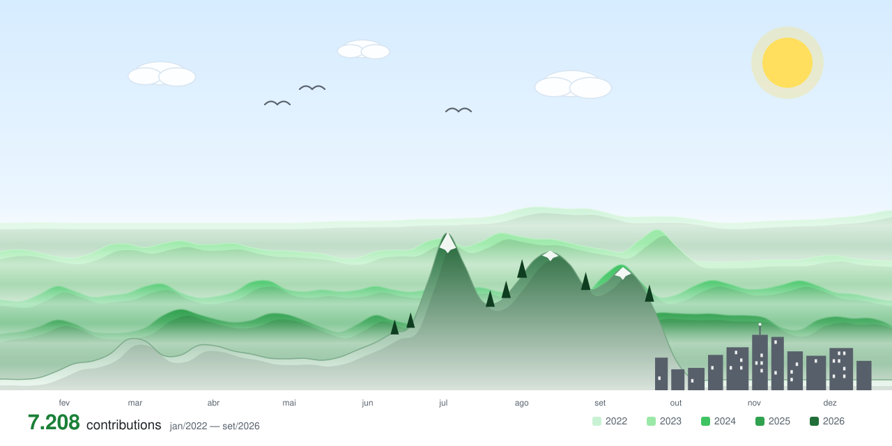

## 🧑‍💻 Sobre mim

- 💼 Desenvolvedor Sênior na [@tradersclub](https://github.com/tradersclub)
- 📫 Como me encontrar: [LinkedIn](https://www.linkedin.com/in/cristian-martini-78bb92210/)

## 🛠️ Tecnologias & Ferramentas

## 🌄 Paisagem de contribuições

<!-- Cada montanha é um ano de contribuições; gerado diariamente pelo GitHub Actions (scripts/generate-full-history.js) -->
<picture>
  <source media="(prefers-color-scheme: dark)" srcset="./profile-3d-contrib/profile-full-dark.svg" />
  
</picture>

---

